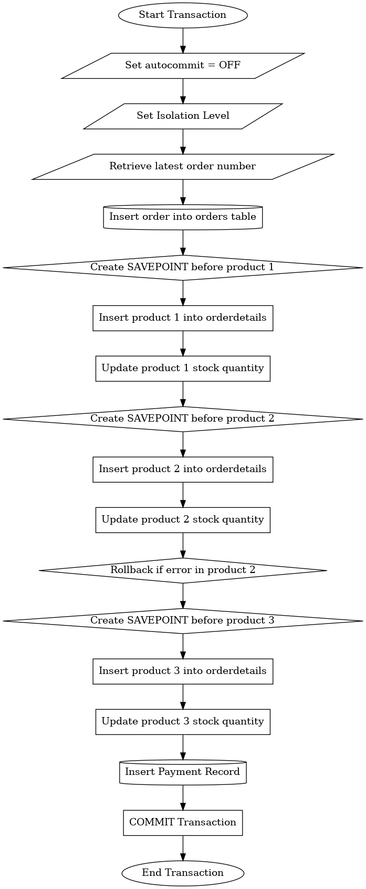

# Lab Submission

## Flowchart

Place your flowchart "" here.

## Pseudocode

``` sql
Type your pseudocode here.
```
BEGIN TRANSACTION
SET autocommit = OFF;
SET TRANSACTION ISOLATION LEVEL SERIALIZABLE;
SET @orderNumber = (SELECT MAX(orderNumber) + 1 FROM orders);
INSERT INTO orders(orderNumber, orderDate, requiredDate, shippedDate, status, customerNumber, totalAmount, amountPaid, balanceDue)
VALUES(@orderNumber, DATE(NOW()), DATE_ADD(NOW(), INTERVAL 3 DAY),
        DATE_ADD(NOW(), INTERVAL 2 DAY), 'In Process', 145, 300000, 0, 300000);
SAVEPOINT before_product_1;
INSERT INTO orderdetails(orderNumber, productCode, quantityOrdered, priceEach, orderLineNumber)
VALUES(@orderNumber, 'S18_1749', 2724, '136', 1);
SET @quantityInStock = (SELECT quantityInStock FROM products WHERE productCode = 'S18_1749');
UPDATE products SET quantityInStock = @quantityInStock - 2724 WHERE productCode = 'S18_1749';
SAVEPOINT before_product_2;
INSERT INTO orderdetails(orderNumber, productCode, quantityOrdered, priceEach, orderLineNumber)
VALUES(@orderNumber, 'S18_2248', 540, '55.09', 2);
SET @quantityInStock = (SELECT quantityInStock FROM products WHERE productCode = 'S18_2248');
UPDATE products SET quantityInStock = @quantityInStock - 540 WHERE productCode = 'S18_2248';
ROLLBACK TO SAVEPOINT before_product_2;
SAVEPOINT before_product_3;
INSERT INTO orderdetails(orderNumber, productCode, quantityOrdered, priceEach, orderLineNumber)
VALUES(@orderNumber, 'S12_1099', 68, '95.34', 3);
SET @quantityInStock = (SELECT quantityInStock FROM products WHERE productCode = 'S12_1099');
UPDATE products SET quantityInStock = @quantityInStock - 68 WHERE productCode = 'S12_1099';
INSERT INTO payments(customerNumber, orderNumber, checkNumber, paymentDate, amount)
VALUES (145, @orderNumber, 'JM555210', DATE(NOW()), 100000);
UPDATE orders SET amountPaid = amountPaid + 100000, balanceDue = balanceDue - 100000 WHERE orderNumber = @orderNumber;

COMMIT;

END TRANSACTION

SELECT orderNumber, customerNumber, totalAmount, amountPaid, balanceDue
FROM orders
WHERE balanceDue > 0;

## Support for the Sales Departments' Report

Explain your proposed solution here.
Improve the Orders Table by adding columns for total amount, amount paid and balance in order to be able to track the finances.